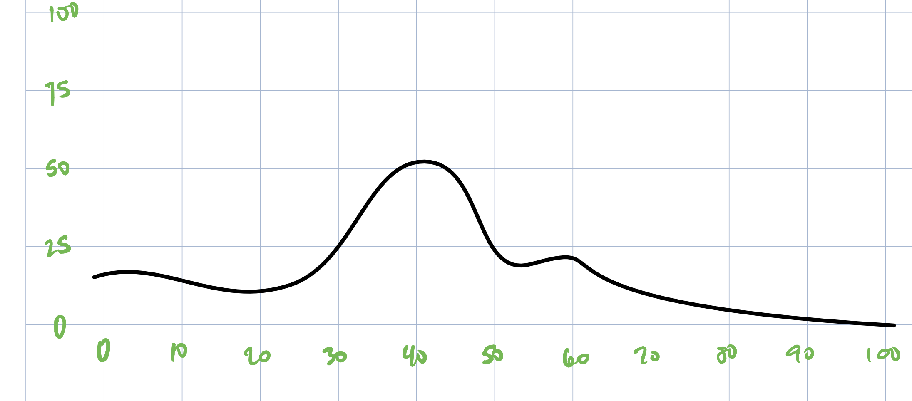

```{r setup, include=FALSE}
knitr::opts_chunk$set(echo = TRUE)

library(tidyverse)
library(hrbrthemes)
library(scales)

```

```{r}

set.seed(2021)
distribution_name <- "distribution_4"
distribution_scale <- "1000"

distr <- read_csv(paste0("distributions/",
                         distribution_name,
                         "-",
                         distribution_scale,
                         ".csv"))


# enter the actual values that you want in the column
scale_x_min <- 0
scale_x_max <- 200000

# enter the range of the 'count' that you want
scale_y_min <- 0
scale_y_max <- 150


```

## Distribution




```{r}
# X scaling
scaled_x <- distr$xVal
scaled_x <- rescale(scaled_x,
                    to = c(scale_x_min,
                           scale_x_max))

# Y scaling
scaled_y <- distr$yVal
scaled_y <- rescale(scaled_y,
                    to = c(scale_y_min,
                           scale_y_max))

distribution <- tibble(xVal = scaled_x,
                       yVal = scaled_y)

distribution <- distribution %>% 
  mutate(yVal = round(yVal))

```


```{r}

# prepare vector with representative samples

d     <- vector()
d_val <- distribution$xVal
d_rep <- distribution$yVal

for (i in 1:length(d_rep)){
  d <- append(d, rep( d_val[i] , d_rep[i]) )
}

```

```{r, fig.width=10, fig.height=4}

d_graph <- tibble(var = d) 

d_graph %>% 
  group_by(var) %>% 
  summarise(n = n()) %>% 
  ggplot(aes(x = var,
             y = n)) +
  geom_point()

```

```{r}

# apply to a new column

vets <- read_csv("csv_files/veterans_table1.csv")
income <- sample(d, dim(vets)[1])

vets <- cbind(vets, income)

```

```{r, fig.width=10, fig.height=4}

vets %>% 
  group_by(income) %>% 
  summarise(n = n()) %>% 
  ggplot( aes(x = income,
              y = n)) +
  geom_point(size = 0.3) +
  theme_ipsum_ps() +
  labs(title = "Using distribution with different scaling",
       subtitle = "Scaled from pre-made distribution",
       x = "Annual Income",
       y = "count of peole",
       caption = "This is just test data for code development only")


```
