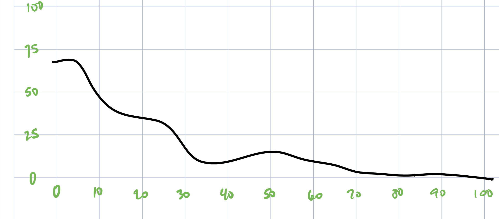

```{r setup, include=FALSE}
knitr::opts_chunk$set(echo = TRUE)

library(tidyverse)
library(png)

```
## Import Distribution Graph



```{r}

distr <- readPNG("images_for_import/distribution_high_to_low_wavy.png")

```

```{r}

distr <- reshape2::melt(distr[,,1] + distr[,,2] + distr[,,3], 
                       varnames = c("imgY", "imgX"), 
                       value.name = "value")

# trim to fit the bounds of 0-100
distr <- distr %>% 
  
  # Choose only black pixels
  filter(value == 0,
         
         # Trim just the graph part, not the edges
         imgY >= 30 & imgY <= 781,
         imgX >= 250 & imgX <=2158) %>% 
  
  # adjust the values by the offset of the graph inside the image
  mutate(imgX = imgX - 250,
         imgY = 781 - imgY)

distr <- distr %>% 
  
  # scale the image to 100 x 100
  mutate(xVal = as.integer(imgX / 1908 * 100),
         yVal = as.integer(imgY / 751 * 100)) %>% 
  group_by(xVal) %>% 
  summarise(xVal, yVal = round(mean(yVal)) ) %>% 
  distinct() %>% 
  filter(yVal > 0,
         xVal > 0)

```

```{r}

# prepare vector with representative samples

d     <- vector()
d_val <- distr$xVal
d_rep <- distr$yVal

for (i in 1:length(d_rep)){
  d <- append(d, rep( toString(d_val[i]), d_rep[i]) )
}

d
```

