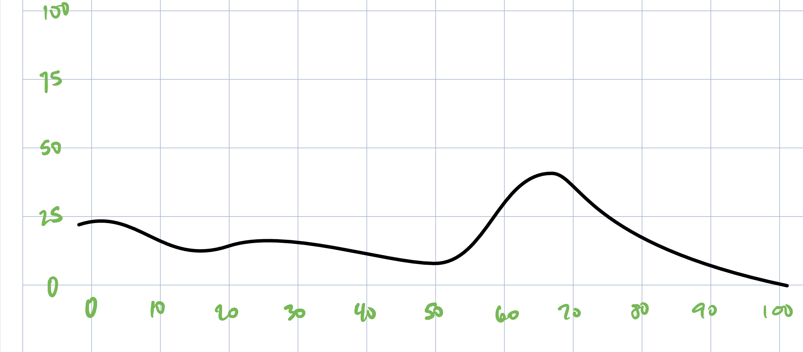

```{r setup, include=FALSE}
knitr::opts_chunk$set(echo = TRUE)

library(tidyverse)
library(hrbrthemes)

```

```{r}

set.seed(2021)
distribution_name <- "distribution_3"
distribution_scale <- "1000"

# enter the actual values that you want in the column
scale_bot  <- 0
scale_top  <- 273500

# enter how many bins you want
scale_step <- 450
```

## Distribution



```{r}

distr <- read_csv(paste0("distributions/",
                         distribution_name,
                         "-",
                         distribution_scale,
                         ".csv"))
```

```{r}

scaling_factor <- (scale_top - scale_bot) / scale_step

# apply scaling
distr <- distr %>% 
  mutate(xVal = xVal * scaling_factor)

```

```{r}

# prepare vector with representative samples

d     <- vector()
d_val <- distr$xVal
d_rep <- distr$yVal

for (i in 1:length(d_rep)){
  d <- append(d, rep( d_val[i] , d_rep[i]) )
}

```

```{r, fig.width=10, fig.height=3}

d_graph <- tibble(var = d) 

d_graph %>% 
  group_by(var) %>% 
  summarise(n = n()) %>% 
  ggplot(aes(x = var,
             y = n)) +
  geom_point()

```

```{r}

# apply to a new column

vets <- read_csv("csv_files/veterans_table1.csv")
income <- sample(d, dim(vets)[1])

vets <- cbind(vets, income)

```

```{r, fig.width=10, fig.height=3}

vets %>% 
  ggplot( aes(x = income)) +
  geom_histogram()

```

