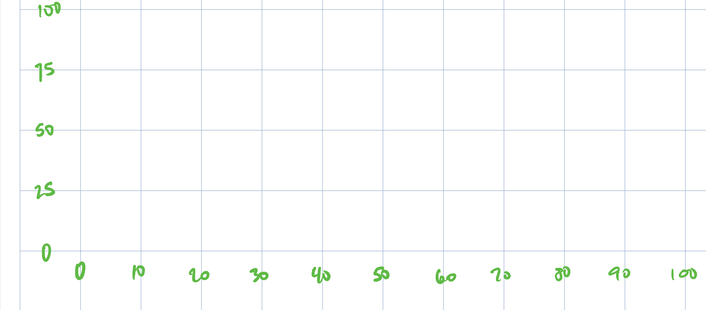
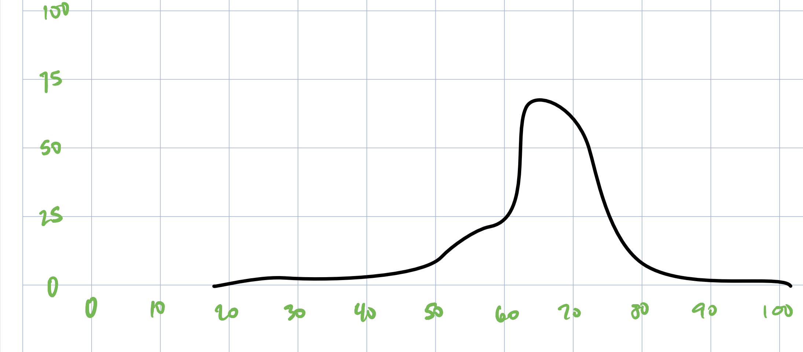

```{r setup, include=FALSE}
knitr::opts_chunk$set(echo = TRUE)

library(tidyverse)
library(png)

```
## Calibration

This is the graph template, which is used for calibration.  There are four single black pixels at 0 and 100, on the x and y axis.  



```{r}


# Calibration of the sample image set the values for X and Y

# x axis is 0 at pixel 250, and 100 at pixel 2158
# y axis is 0 at pixel 781, and 100 at pixel 30
#
# This can be confusing, since we look at graphs from the origin
# of 0,0 at the lower left of a chart.  Images have the origin
# at the top left, with the first pixel being (1,1).

distr <- readPNG("images_for_import/distribution_veteran_age.png")

```

## Distribution to import




```{r}

distr <- reshape2::melt(distr[,,1] + distr[,,2] + distr[,,3], 
                       varnames = c("imgY", "imgX"), 
                       value.name = "value")

# trim to fit the bounds of 0-100
distr <- distr %>% 
  
  # Choose only black pixels
  filter(value == 0,
         
         # Trim just the graph part, not the edges
         imgY >= 30 & imgY <= 781,
         imgX >= 250 & imgX <=2158) %>% 
  
  # adjust the values by the offset of the graph inside the image
  mutate(imgX = imgX - 250,
         imgY = 781 - imgY)

distr <- distr %>% 
  
  # scale the image to 100 x 100
  mutate(xVal = as.integer(imgX / 1908 * 100),
         yVal = as.integer(imgY / 751 * 100)) %>% 
  group_by(xVal) %>% 
  summarise(xVal, yVal = round(mean(yVal)) ) %>% 
  distinct() %>% 
  filter(yVal > 0)
  
```

This one needs no scaling, since it was for the age distribution of veterans.  The lowest number is 21 and the highest is 98.

```{r, fig.width=6, fig.height=2}

distr %>% 
  ggplot(aes(x = xVal,
             y = yVal)) +
  geom_point()

```

```{r}

write_csv(distr, "distributions/veteran_ages.csv")

```


